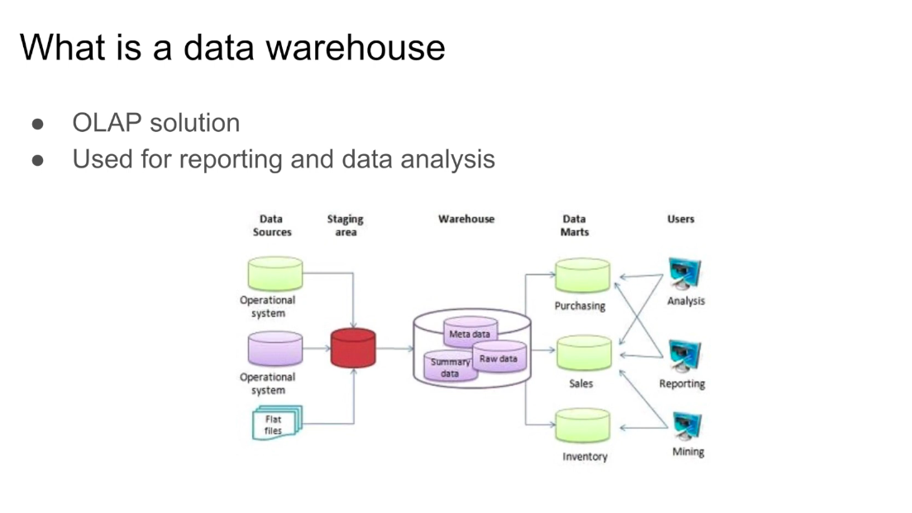

# Week 3 | Data Warehouse and Bigquery
## 3.1.1 Data Warehouse and Bigquery 
- 00:00 Agenda
- 00:28 OLAP vs OLTP
    - OLAP (Online Analytical Processing) - for data insights
    - OLTP (Online Transaction Processing) - for efficiency
- 02:18 What is a data warehouse
    - OLAP

- 03:36 BigQuery
    - serverless data warehouse
    - software and infra
    - flexibility separating compute engine and data storage
    - built-in features - ML, GA, BI
- 05:19 BigQuery interface
- 07:04 Querying public datasets
- 07:42 BigQuery costs
- 09:02 Create an external table
- 12:04 Partitioning
- 18:45 Clustering
